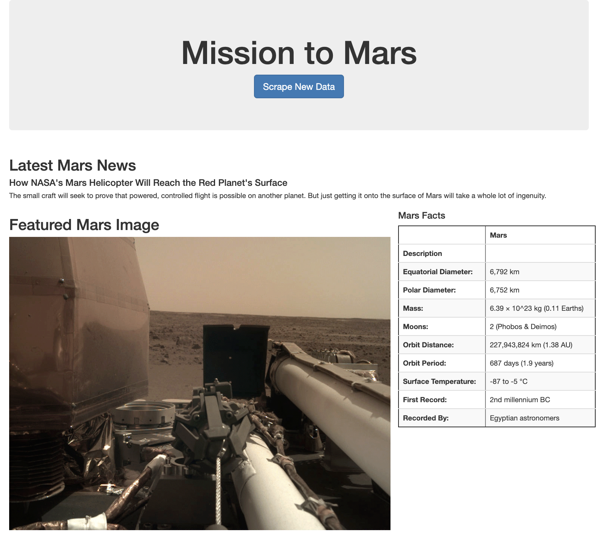

# Web Scraping - Mission to Mars


Built a web application that scrapes various websites for data related to the Mission to Mars and displays the information in a single HTML page. 

## Step 1 - Scraping

Completed my initial scraping using Jupyter Notebook, BeautifulSoup, Pandas, and Requests/Splinter.

* Created a Jupyter Notebook file called `mission_to_mars.ipynb` and used it to complete all of my scraping and analysis tasks. 

### NASA Mars News

* Scraped the [NASA Mars News Site](https://mars.nasa.gov/news/) and collected the latest News Title and Paragraph Text. Assigned the text to variables that  I referenced later.

```python
# Example:
news_title = "NASA's Next Mars Mission to Investigate Interior of Red Planet"

news_p = "Preparation of NASA's next spacecraft to Mars, InSight, has ramped up this summer, on course for launch next May from Vandenberg Air Force Base in central California -- the first interplanetary launch in history from America's West Coast."
```

### JPL Mars Space Images - Featured Image

* Visited the url for JPL Featured Space Image [here](https://data-class-jpl-space.s3.amazonaws.com/JPL_Space/index.html).

* Used splinter to navigate the site and find the image url for the current Featured Mars Image and assigned the url string to a variable called `featured_image_url`.

* Made sure I found the image url to the full size `.jpg` image.

* Made sure I saved a complete url string for this image.

```python
# Example:
featured_image_url = 'https://data-class-jpl-space.s3.amazonaws.com/JPL_Space/image/featured/mars2.jpg'
```

### Mars Facts

* Visited the Mars Facts webpage [here](https://space-facts.com/mars/) and used Pandas to scrape the table containing facts about the planet including Diameter, Mass, etc.

* Used Pandas to convert the data to a HTML table string.

### Mars Hemispheres

* Visited the USGS Astrogeology site [here](https://astrogeology.usgs.gov/search/results?q=hemisphere+enhanced&k1=target&v1=Mars) to obtain high resolution images for each of Mar's hemispheres.

* Clicked each of the links to the hemispheres in order to find the image url to the full resolution image.

* Saved both the image url string for the full resolution hemisphere image, and the Hemisphere title containing the hemisphere name. Used a Python dictionary to store the data using the keys `img_url` and `title`.

* Appended the dictionary with the image url string and the hemisphere title to a list. 

```python
# Example:
hemisphere_image_urls = [
    {"title": "Valles Marineris Hemisphere", "img_url": "..."},
    {"title": "Cerberus Hemisphere", "img_url": "..."},
    {"title": "Schiaparelli Hemisphere", "img_url": "..."},
    {"title": "Syrtis Major Hemisphere", "img_url": "..."},
]
```

- - -

## Step 2 - MongoDB and Flask Application

Used MongoDB with Flask templating to create a new HTML page that displayed all of the information that was scraped from the URLs above.

* Started by converting your Jupyter notebook into a Python script called `scrape_mars.py` with a function called `scrape` that executed all of my scraping code from above and returned one Python dictionary containing all of the scraped data.

* Next, I created a route called `/scrape` that imported my `scrape_mars.py` script and called my `scrape` function.

  * Stored the return value in Mongo as a Python dictionary.

* Created a root route `/` that queried my Mongo database and passed the mars data into an HTML template to display the data.

* Created a template HTML file called `index.html` that took the mars data dictionary and displayed all of the data in the appropriate HTML elements. 
* 



3. Submit the link to your new repository to BootCampSpot.

4. Ensure your repository has regular commits (i.e. 20+ commits) and a thorough README.md file

## Hints

* Use Splinter to navigate the sites when needed and BeautifulSoup to help find and parse out the necessary data.

* Use Pymongo for CRUD applications for your database. For this homework, you can simply overwrite the existing document each time the `/scrape` url is visited and new data is obtained.

* Use Bootstrap to structure your HTML template.

### Copyright

Trilogy Education Services © 2021. All Rights Reserved.
